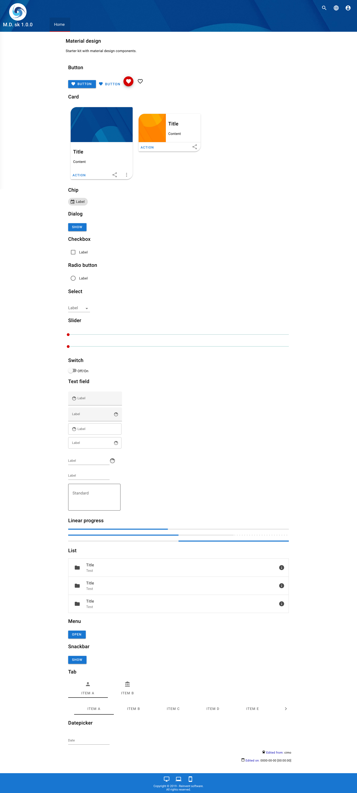
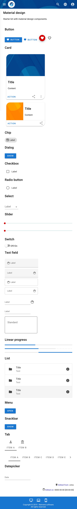

Material design sk
==============

Starter kit with material design components.

All folders are organize for easy and fast develop.

| Info: |
|:---|
| Cross browser and responsive (Chrome, Firefox, Edge, Opera, Safari) |
| Cross platform (Windows, Linux, Mac, Android, Ios) |

| Elements: |
|:---|
| Button |
| Card |
| Chip |
| Dialog |
| Checkbox |
| Radio button |
| Select |
| Slider |
| Switch |
| Text field |
| Linear progress |
| List |
| Menu |
| Snackbar |
| Tab |
| Datepicker |

## Images:

| Library: |
|:---|
| Material design web - https://material.io/develop/web/ |

<b>By CIMO - https://www.reinventsoftware.org</b>